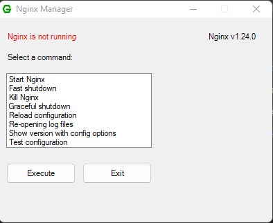
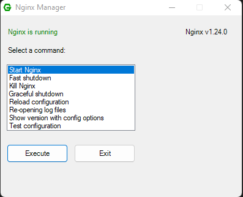
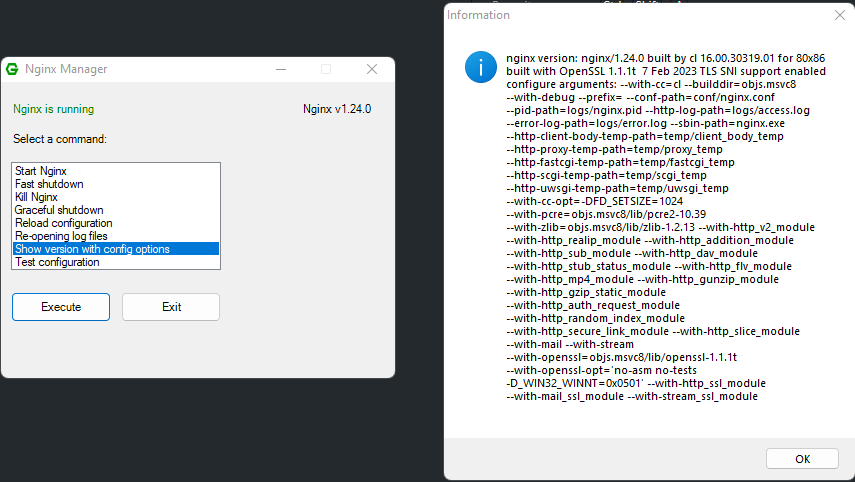

# Nginx-Manager

A simple to simply manage Nginx on Windows on a (G)UI.

## For Users

1. Download Nginx-Manager.exe from the current release
2. Move Nginx-Manager.exe into your ROOT-folder from NGINX (Where the nginx.exe is located)
3. Run it.

## For Devs

1. Download the source-code
2. Make your changes
3. (Optional) Convert the script to an executable with ps2exe.ps1
4. (Optional) Create a pull request

## Screenshots
Screenshot 1:

Screenshot 2:

Screenshot 3:

